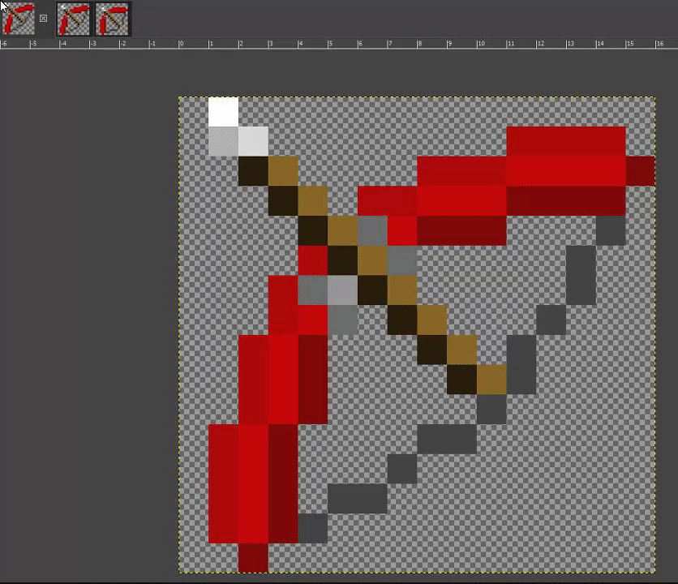

# Bow

The bow animates as you pull it, this allows you to have a single texture/model for each of these states.


<Warning>
It is very important to set the textures to your bow item that should have set them to avoid problem with missing texture:


</Warning>


To use the status textures, you need to add suffixes to your model filename or texture.

If you plan to use textures (png) you had to set `generate: true`.\
If you plan to use models (json) you have to set `generate: false`, as you already have the models.&#x20;

## Suffixes for items

* `BOW`
  * `_0` - First pulling state.
  * `_1` - Second pulling state.
  * `_2` - Third pulling state.
* `FISHING_ROD`
  * `_cast` - Shows a fishing rod when it is cast.
* `SHIELD`
  * `_blocking` - Shows a shield model when you are blocking with it.
* `BUNDLE`
  * `_filled` - Displays a bundle when it is filled.

## Adding item states using suffixes (bow)

Firstly you need to create three pulling states for our bow.



Save them, drop to the directory where is your original bow texture and add suffixes to your textures like this:

I put them into `contents/myitems/textures/item/` folder of my resourcepack.

<div align="left"></div>


<Note>
Suffixes also work on model names (json).\
I put them into `contents/myitems/models/item/` folder of my resourcepack.


</Note>


```yaml
items:
  ruby_bow:
    enabled: true
    display_name: Example Ruby Bow
    permission: myitems.bows.ruby_bow
    resource:
      material: BOW
      generate: true
      textures:
        - item/bows/ruby_bow
```

## Done

You have working bow with item states.


